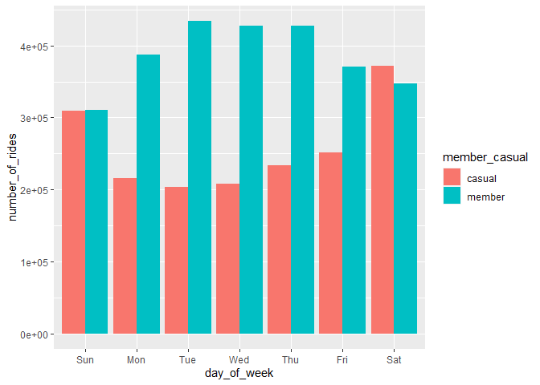
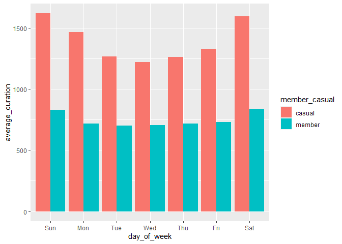

Cyclistic case study
================
2023-04-04

# CYCLISTIC case study.

## 1. Introduction

This is a case study from one of the courses that I’m doing to learn
data analysis/data science and machine learning. The Cyclistic case
study is focused on data analysis.

I will be following these steps of the data analysis process:

- Ask

- Prepare

- Process

- Analyze

- Share

- Act

#### 1.1 Scenario

You are a junior data analyst working in the marketing analyst team at
Cyclistic, a bike-share company in Chicago. The director of marketing
believes the company’s future success depends on maximizing the number
of annual memberships. Therefore, your team wants to understand how
casual riders and annual members use Cyclistic bikes differently. From
these insights, your team will design a new marketing strategy to
convert casual riders into annual members. But first, Cyclistic
executives must approve your recommendations, so they must be backed up
with compelling data insights and professional data visualizations.

#### 1.2 Characters and teams

- Cyclistic: A bike-share program that features more than 5,800 bicycles
  and 600 docking stations. Cyclistic sets itself apart by also offering
  reclining bikes, hand tricycles, and cargo bikes, making bike-share
  more inclusive to people with disabilities and riders who can’t use a
  standard two-wheeled bike. The majority of riders opt for traditional
  bikes; about 8% of riders use the assistive options. Cyclistic users
  are more likely to ride for leisure, but about 30% use them to commute
  to work each day.
- Lily Moreno: The director of marketing and your manager. Moreno is
  responsible for the development of campaigns and initiatives to
  promote the bike-share program. These may include email, social media,
  and other channels.
- Cyclistic marketing analytics team: A team of data analysts who are
  responsible for collecting, analyzing, and reporting data that helps
  guide Cyclistic marketing strategy. You joined this team six months
  ago and have been busy learning about Cyclistic’s mission and business
  goals — as well as how you, as a junior data analyst, can help
  Cyclistic achieve them.
- Cyclistic executive team: The notoriously detail-oriented executive
  team will decide whether to approve the recommended marketing program.

#### 1.3 About the company

In 2016, Cyclistic launched a successful bike-share offering. Since
then, the program has grown to a fleet of 5,824 bicycles that are
geotracked and locked into a network of 692 stations across Chicago. The
bikes can be unlocked from one station and returned to any other station
in the system anytime. Until now, Cyclistic’s marketing strategy relied
on building general awareness and appealing to broad consumer segments.
One approach that helped make these things possible was the flexibility
of its pricing plans: single-ride passes, full-day passes, and annual
memberships. Customers who purchase single-ride or full-day passes are
referred to as casual riders. Customers who purchase annual memberships
are Cyclistic members. Cyclistic’s finance analysts have concluded that
annual members are much more profitable than casual riders. Although the
pricing flexibility helps Cyclistic attract more customers, Moreno
believes that maximizing the number of annual members will be key to
future growth. Rather than creating a marketing campaign that targets
all-new customers, Moreno believes there is a very good chance to
convert casual riders into members. She notes that casual riders are
already aware of the Cyclistic program and have chosen Cyclistic for
their mobility needs. Moreno has set a clear goal: Design marketing
strategies aimed at converting casual riders into annual members. In
order to do that, however, the marketing analyst team needs to better
understand how annual members and casual riders differ, why casual
riders would buy a membership, and how digital media could affect their
marketing tactics. Moreno and her team are interested in analyzing the
Cyclistic historical bike trip data to identify trends.

## 2. Asking

**Three questions will guide the future marketing program:**

1.  How do annual members and casual riders use Cyclistic bikes
    differently?

    *(this question was assigned to me.)*

2.  Why would casual riders buy Cyclistic annual memberships?

3.  How can Cyclistic use digital media to influence casual riders to
    become members?

**I will be producing a report with the following derivables:**

1.  A clear statement of the business task

2.  A description of all data sources used

3.  Documentation of any cleaning or manipulation of data

4.  A summary of the data analysis

5.  Supporting visualizations and key findings

6.  Top three recommendations based on my analysis

**During this case study, i will be working with data to help the
company to find ways to maximize the quantity of annual memberships.My
insights will support Cyclistic to understand how Annual members and
Casual Riders use Cyclistic bikes differently, and with the analysis,
help the company to achieve the goal of maximizing annual memberships**.

\##3. Preparing

You can found the data collected in this
[link](https://divvy-tripdata.s3.amazonaws.com/index.html) .

This data is the last 12 months(from Mar 2022 to Feb 2022) of Cyclistic
trip data and there is no issues with credibility or bias on this data,
it was collected by Cyclistic and it regards all users with no
preference.

License can be found
[here](https://ride.divvybikes.com/data-license-agreement). It’s
**prohibited** to use riders’ personally identifiable information.

I verified the data integrity by cleaning and checking the data and
there are no problems with the data.

*How does it help you answer your question? ( CHECK it later)*

\##4. Processing

In this case study, I will be using R(Rstudio and R Markdown) to clean,
manipulate, analyze and create data visualizations.

*Loading libraries* *Tidyverse includes lubridate, ggplot2, dplyr,
tidyr, tibble and others* *Janitor is used to compare columns in the
dataset*

``` r
library(tidyverse)
```

    ## ── Attaching core tidyverse packages ──────────────────────── tidyverse 2.0.0 ──
    ## ✔ dplyr     1.1.1     ✔ readr     2.1.4
    ## ✔ forcats   1.0.0     ✔ stringr   1.5.0
    ## ✔ ggplot2   3.4.1     ✔ tibble    3.2.1
    ## ✔ lubridate 1.9.2     ✔ tidyr     1.3.0
    ## ✔ purrr     1.0.1     
    ## ── Conflicts ────────────────────────────────────────── tidyverse_conflicts() ──
    ## ✖ dplyr::filter() masks stats::filter()
    ## ✖ dplyr::lag()    masks stats::lag()
    ## ℹ Use the conflicted package (<http://conflicted.r-lib.org/>) to force all conflicts to become errors

``` r
library(janitor)
```

    ## 
    ## Attaching package: 'janitor'
    ## 
    ## The following objects are masked from 'package:stats':
    ## 
    ##     chisq.test, fisher.test

**Reading files:**

``` r
tripdata2022_03 = read_csv("csv_files/202203-divvy-tripdata.csv")
```

    ## Rows: 284042 Columns: 13
    ## ── Column specification ────────────────────────────────────────────────────────
    ## Delimiter: ","
    ## chr  (7): ride_id, rideable_type, start_station_name, start_station_id, end_...
    ## dbl  (4): start_lat, start_lng, end_lat, end_lng
    ## dttm (2): started_at, ended_at
    ## 
    ## ℹ Use `spec()` to retrieve the full column specification for this data.
    ## ℹ Specify the column types or set `show_col_types = FALSE` to quiet this message.

``` r
tripdata2022_04 = read_csv("csv_files/202204-divvy-tripdata.csv")
```

    ## Rows: 371249 Columns: 13
    ## ── Column specification ────────────────────────────────────────────────────────
    ## Delimiter: ","
    ## chr  (7): ride_id, rideable_type, start_station_name, start_station_id, end_...
    ## dbl  (4): start_lat, start_lng, end_lat, end_lng
    ## dttm (2): started_at, ended_at
    ## 
    ## ℹ Use `spec()` to retrieve the full column specification for this data.
    ## ℹ Specify the column types or set `show_col_types = FALSE` to quiet this message.

``` r
tripdata2022_05 = read_csv("csv_files/202205-divvy-tripdata.csv")
```

    ## Rows: 634858 Columns: 13
    ## ── Column specification ────────────────────────────────────────────────────────
    ## Delimiter: ","
    ## chr  (7): ride_id, rideable_type, start_station_name, start_station_id, end_...
    ## dbl  (4): start_lat, start_lng, end_lat, end_lng
    ## dttm (2): started_at, ended_at
    ## 
    ## ℹ Use `spec()` to retrieve the full column specification for this data.
    ## ℹ Specify the column types or set `show_col_types = FALSE` to quiet this message.

``` r
tripdata2022_06 = read_csv("csv_files/202206-divvy-tripdata.csv")
```

    ## Rows: 769204 Columns: 13
    ## ── Column specification ────────────────────────────────────────────────────────
    ## Delimiter: ","
    ## chr  (7): ride_id, rideable_type, start_station_name, start_station_id, end_...
    ## dbl  (4): start_lat, start_lng, end_lat, end_lng
    ## dttm (2): started_at, ended_at
    ## 
    ## ℹ Use `spec()` to retrieve the full column specification for this data.
    ## ℹ Specify the column types or set `show_col_types = FALSE` to quiet this message.

``` r
tripdata2022_07 = read_csv("csv_files/202207-divvy-tripdata.csv")
```

    ## Rows: 823488 Columns: 13
    ## ── Column specification ────────────────────────────────────────────────────────
    ## Delimiter: ","
    ## chr  (7): ride_id, rideable_type, start_station_name, start_station_id, end_...
    ## dbl  (4): start_lat, start_lng, end_lat, end_lng
    ## dttm (2): started_at, ended_at
    ## 
    ## ℹ Use `spec()` to retrieve the full column specification for this data.
    ## ℹ Specify the column types or set `show_col_types = FALSE` to quiet this message.

``` r
tripdata2022_08 = read_csv("csv_files/202208-divvy-tripdata.csv")
```

    ## Rows: 785932 Columns: 13
    ## ── Column specification ────────────────────────────────────────────────────────
    ## Delimiter: ","
    ## chr  (7): ride_id, rideable_type, start_station_name, start_station_id, end_...
    ## dbl  (4): start_lat, start_lng, end_lat, end_lng
    ## dttm (2): started_at, ended_at
    ## 
    ## ℹ Use `spec()` to retrieve the full column specification for this data.
    ## ℹ Specify the column types or set `show_col_types = FALSE` to quiet this message.

``` r
tripdata2022_09 = read_csv("csv_files/202209-divvy-publictripdata.csv")
```

    ## Rows: 701339 Columns: 13
    ## ── Column specification ────────────────────────────────────────────────────────
    ## Delimiter: ","
    ## chr  (7): ride_id, rideable_type, start_station_name, start_station_id, end_...
    ## dbl  (4): start_lat, start_lng, end_lat, end_lng
    ## dttm (2): started_at, ended_at
    ## 
    ## ℹ Use `spec()` to retrieve the full column specification for this data.
    ## ℹ Specify the column types or set `show_col_types = FALSE` to quiet this message.

``` r
tripdata2022_10 = read_csv("csv_files/202210-divvy-tripdata.csv")
```

    ## Rows: 558685 Columns: 13
    ## ── Column specification ────────────────────────────────────────────────────────
    ## Delimiter: ","
    ## chr  (7): ride_id, rideable_type, start_station_name, start_station_id, end_...
    ## dbl  (4): start_lat, start_lng, end_lat, end_lng
    ## dttm (2): started_at, ended_at
    ## 
    ## ℹ Use `spec()` to retrieve the full column specification for this data.
    ## ℹ Specify the column types or set `show_col_types = FALSE` to quiet this message.

``` r
tripdata2022_11 = read_csv("csv_files/202211-divvy-tripdata.csv")
```

    ## Rows: 337735 Columns: 13
    ## ── Column specification ────────────────────────────────────────────────────────
    ## Delimiter: ","
    ## chr  (7): ride_id, rideable_type, start_station_name, start_station_id, end_...
    ## dbl  (4): start_lat, start_lng, end_lat, end_lng
    ## dttm (2): started_at, ended_at
    ## 
    ## ℹ Use `spec()` to retrieve the full column specification for this data.
    ## ℹ Specify the column types or set `show_col_types = FALSE` to quiet this message.

``` r
tripdata2022_12 = read_csv("csv_files/202212-divvy-tripdata.csv")
```

    ## Rows: 181806 Columns: 13
    ## ── Column specification ────────────────────────────────────────────────────────
    ## Delimiter: ","
    ## chr  (7): ride_id, rideable_type, start_station_name, start_station_id, end_...
    ## dbl  (4): start_lat, start_lng, end_lat, end_lng
    ## dttm (2): started_at, ended_at
    ## 
    ## ℹ Use `spec()` to retrieve the full column specification for this data.
    ## ℹ Specify the column types or set `show_col_types = FALSE` to quiet this message.

``` r
tripdata2023_01 = read_csv("csv_files/202301-divvy-tripdata.csv")
```

    ## Rows: 190301 Columns: 13
    ## ── Column specification ────────────────────────────────────────────────────────
    ## Delimiter: ","
    ## chr  (7): ride_id, rideable_type, start_station_name, start_station_id, end_...
    ## dbl  (4): start_lat, start_lng, end_lat, end_lng
    ## dttm (2): started_at, ended_at
    ## 
    ## ℹ Use `spec()` to retrieve the full column specification for this data.
    ## ℹ Specify the column types or set `show_col_types = FALSE` to quiet this message.

``` r
tripdata2023_02 = read_csv("csv_files/202302-divvy-tripdata.csv")
```

    ## Rows: 190445 Columns: 13
    ## ── Column specification ────────────────────────────────────────────────────────
    ## Delimiter: ","
    ## chr  (7): ride_id, rideable_type, start_station_name, start_station_id, end_...
    ## dbl  (4): start_lat, start_lng, end_lat, end_lng
    ## dttm (2): started_at, ended_at
    ## 
    ## ℹ Use `spec()` to retrieve the full column specification for this data.
    ## ℹ Specify the column types or set `show_col_types = FALSE` to quiet this message.

*Checking if column names are the same in each dataset in order to bind,
also checking structure.*

``` r
library(janitor)
compare_df_cols(tripdata2022_03, tripdata2022_04,tripdata2022_05,tripdata2022_06,tripdata2022_07,tripdata2022_08,tripdata2022_09,tripdata2022_10,tripdata2022_11,tripdata2022_12,tripdata2023_01,tripdata2023_02)
```

    ##           column_name tripdata2022_03 tripdata2022_04 tripdata2022_05
    ## 1             end_lat         numeric         numeric         numeric
    ## 2             end_lng         numeric         numeric         numeric
    ## 3      end_station_id       character       character       character
    ## 4    end_station_name       character       character       character
    ## 5            ended_at POSIXct, POSIXt POSIXct, POSIXt POSIXct, POSIXt
    ## 6       member_casual       character       character       character
    ## 7             ride_id       character       character       character
    ## 8       rideable_type       character       character       character
    ## 9           start_lat         numeric         numeric         numeric
    ## 10          start_lng         numeric         numeric         numeric
    ## 11   start_station_id       character       character       character
    ## 12 start_station_name       character       character       character
    ## 13         started_at POSIXct, POSIXt POSIXct, POSIXt POSIXct, POSIXt
    ##    tripdata2022_06 tripdata2022_07 tripdata2022_08 tripdata2022_09
    ## 1          numeric         numeric         numeric         numeric
    ## 2          numeric         numeric         numeric         numeric
    ## 3        character       character       character       character
    ## 4        character       character       character       character
    ## 5  POSIXct, POSIXt POSIXct, POSIXt POSIXct, POSIXt POSIXct, POSIXt
    ## 6        character       character       character       character
    ## 7        character       character       character       character
    ## 8        character       character       character       character
    ## 9          numeric         numeric         numeric         numeric
    ## 10         numeric         numeric         numeric         numeric
    ## 11       character       character       character       character
    ## 12       character       character       character       character
    ## 13 POSIXct, POSIXt POSIXct, POSIXt POSIXct, POSIXt POSIXct, POSIXt
    ##    tripdata2022_10 tripdata2022_11 tripdata2022_12 tripdata2023_01
    ## 1          numeric         numeric         numeric         numeric
    ## 2          numeric         numeric         numeric         numeric
    ## 3        character       character       character       character
    ## 4        character       character       character       character
    ## 5  POSIXct, POSIXt POSIXct, POSIXt POSIXct, POSIXt POSIXct, POSIXt
    ## 6        character       character       character       character
    ## 7        character       character       character       character
    ## 8        character       character       character       character
    ## 9          numeric         numeric         numeric         numeric
    ## 10         numeric         numeric         numeric         numeric
    ## 11       character       character       character       character
    ## 12       character       character       character       character
    ## 13 POSIXct, POSIXt POSIXct, POSIXt POSIXct, POSIXt POSIXct, POSIXt
    ##    tripdata2023_02
    ## 1          numeric
    ## 2          numeric
    ## 3        character
    ## 4        character
    ## 5  POSIXct, POSIXt
    ## 6        character
    ## 7        character
    ## 8        character
    ## 9          numeric
    ## 10         numeric
    ## 11       character
    ## 12       character
    ## 13 POSIXct, POSIXt

``` r
str(tripdata2022_03)
```

    ## spc_tbl_ [284,042 × 13] (S3: spec_tbl_df/tbl_df/tbl/data.frame)
    ##  $ ride_id           : chr [1:284042] "47EC0A7F82E65D52" "8494861979B0F477" "EFE527AF80B66109" "9F446FD9DEE3F389" ...
    ##  $ rideable_type     : chr [1:284042] "classic_bike" "electric_bike" "classic_bike" "classic_bike" ...
    ##  $ started_at        : POSIXct[1:284042], format: "2022-03-21 13:45:01" "2022-03-16 09:37:16" ...
    ##  $ ended_at          : POSIXct[1:284042], format: "2022-03-21 13:51:18" "2022-03-16 09:43:34" ...
    ##  $ start_station_name: chr [1:284042] "Wabash Ave & Wacker Pl" "Michigan Ave & Oak St" "Broadway & Berwyn Ave" "Wabash Ave & Wacker Pl" ...
    ##  $ start_station_id  : chr [1:284042] "TA1307000131" "13042" "13109" "TA1307000131" ...
    ##  $ end_station_name  : chr [1:284042] "Kingsbury St & Kinzie St" "Orleans St & Chestnut St (NEXT Apts)" "Broadway & Ridge Ave" "Franklin St & Jackson Blvd" ...
    ##  $ end_station_id    : chr [1:284042] "KA1503000043" "620" "15578" "TA1305000025" ...
    ##  $ start_lat         : num [1:284042] 41.9 41.9 42 41.9 41.9 ...
    ##  $ start_lng         : num [1:284042] -87.6 -87.6 -87.7 -87.6 -87.6 ...
    ##  $ end_lat           : num [1:284042] 41.9 41.9 42 41.9 41.9 ...
    ##  $ end_lng           : num [1:284042] -87.6 -87.6 -87.7 -87.6 -87.7 ...
    ##  $ member_casual     : chr [1:284042] "member" "member" "member" "member" ...
    ##  - attr(*, "spec")=
    ##   .. cols(
    ##   ..   ride_id = col_character(),
    ##   ..   rideable_type = col_character(),
    ##   ..   started_at = col_datetime(format = ""),
    ##   ..   ended_at = col_datetime(format = ""),
    ##   ..   start_station_name = col_character(),
    ##   ..   start_station_id = col_character(),
    ##   ..   end_station_name = col_character(),
    ##   ..   end_station_id = col_character(),
    ##   ..   start_lat = col_double(),
    ##   ..   start_lng = col_double(),
    ##   ..   end_lat = col_double(),
    ##   ..   end_lng = col_double(),
    ##   ..   member_casual = col_character()
    ##   .. )
    ##  - attr(*, "problems")=<externalptr>

``` r
str(tripdata2022_04)
```

    ## spc_tbl_ [371,249 × 13] (S3: spec_tbl_df/tbl_df/tbl/data.frame)
    ##  $ ride_id           : chr [1:371249] "3564070EEFD12711" "0B820C7FCF22F489" "89EEEE32293F07FF" "84D4751AEB31888D" ...
    ##  $ rideable_type     : chr [1:371249] "electric_bike" "classic_bike" "classic_bike" "classic_bike" ...
    ##  $ started_at        : POSIXct[1:371249], format: "2022-04-06 17:42:48" "2022-04-24 19:23:07" ...
    ##  $ ended_at          : POSIXct[1:371249], format: "2022-04-06 17:54:36" "2022-04-24 19:43:17" ...
    ##  $ start_station_name: chr [1:371249] "Paulina St & Howard St" "Wentworth Ave & Cermak Rd" "Halsted St & Polk St" "Wentworth Ave & Cermak Rd" ...
    ##  $ start_station_id  : chr [1:371249] "515" "13075" "TA1307000121" "13075" ...
    ##  $ end_station_name  : chr [1:371249] "University Library (NU)" "Green St & Madison St" "Green St & Madison St" "Delano Ct & Roosevelt Rd" ...
    ##  $ end_station_id    : chr [1:371249] "605" "TA1307000120" "TA1307000120" "KA1706005007" ...
    ##  $ start_lat         : num [1:371249] 42 41.9 41.9 41.9 41.9 ...
    ##  $ start_lng         : num [1:371249] -87.7 -87.6 -87.6 -87.6 -87.6 ...
    ##  $ end_lat           : num [1:371249] 42.1 41.9 41.9 41.9 41.9 ...
    ##  $ end_lng           : num [1:371249] -87.7 -87.6 -87.6 -87.6 -87.6 ...
    ##  $ member_casual     : chr [1:371249] "member" "member" "member" "casual" ...
    ##  - attr(*, "spec")=
    ##   .. cols(
    ##   ..   ride_id = col_character(),
    ##   ..   rideable_type = col_character(),
    ##   ..   started_at = col_datetime(format = ""),
    ##   ..   ended_at = col_datetime(format = ""),
    ##   ..   start_station_name = col_character(),
    ##   ..   start_station_id = col_character(),
    ##   ..   end_station_name = col_character(),
    ##   ..   end_station_id = col_character(),
    ##   ..   start_lat = col_double(),
    ##   ..   start_lng = col_double(),
    ##   ..   end_lat = col_double(),
    ##   ..   end_lng = col_double(),
    ##   ..   member_casual = col_character()
    ##   .. )
    ##  - attr(*, "problems")=<externalptr>

``` r
#...
```

*They all have the same name, so it’s possible to bind, i do not need to
rename, datatype are also equal, do not need to change*

*Now, i need to bind all datasets into one.*

``` r
all_trips = bind_rows(tripdata2022_03, tripdata2022_04,tripdata2022_05,tripdata2022_06,tripdata2022_07,tripdata2022_08,tripdata2022_09,tripdata2022_10,tripdata2022_11,tripdata2022_12,tripdata2023_01,tripdata2023_02)
```

*Checking the new dataset*

``` r
str(all_trips)
```

    ## spc_tbl_ [5,829,084 × 13] (S3: spec_tbl_df/tbl_df/tbl/data.frame)
    ##  $ ride_id           : chr [1:5829084] "47EC0A7F82E65D52" "8494861979B0F477" "EFE527AF80B66109" "9F446FD9DEE3F389" ...
    ##  $ rideable_type     : chr [1:5829084] "classic_bike" "electric_bike" "classic_bike" "classic_bike" ...
    ##  $ started_at        : POSIXct[1:5829084], format: "2022-03-21 13:45:01" "2022-03-16 09:37:16" ...
    ##  $ ended_at          : POSIXct[1:5829084], format: "2022-03-21 13:51:18" "2022-03-16 09:43:34" ...
    ##  $ start_station_name: chr [1:5829084] "Wabash Ave & Wacker Pl" "Michigan Ave & Oak St" "Broadway & Berwyn Ave" "Wabash Ave & Wacker Pl" ...
    ##  $ start_station_id  : chr [1:5829084] "TA1307000131" "13042" "13109" "TA1307000131" ...
    ##  $ end_station_name  : chr [1:5829084] "Kingsbury St & Kinzie St" "Orleans St & Chestnut St (NEXT Apts)" "Broadway & Ridge Ave" "Franklin St & Jackson Blvd" ...
    ##  $ end_station_id    : chr [1:5829084] "KA1503000043" "620" "15578" "TA1305000025" ...
    ##  $ start_lat         : num [1:5829084] 41.9 41.9 42 41.9 41.9 ...
    ##  $ start_lng         : num [1:5829084] -87.6 -87.6 -87.7 -87.6 -87.6 ...
    ##  $ end_lat           : num [1:5829084] 41.9 41.9 42 41.9 41.9 ...
    ##  $ end_lng           : num [1:5829084] -87.6 -87.6 -87.7 -87.6 -87.7 ...
    ##  $ member_casual     : chr [1:5829084] "member" "member" "member" "member" ...
    ##  - attr(*, "spec")=
    ##   .. cols(
    ##   ..   ride_id = col_character(),
    ##   ..   rideable_type = col_character(),
    ##   ..   started_at = col_datetime(format = ""),
    ##   ..   ended_at = col_datetime(format = ""),
    ##   ..   start_station_name = col_character(),
    ##   ..   start_station_id = col_character(),
    ##   ..   end_station_name = col_character(),
    ##   ..   end_station_id = col_character(),
    ##   ..   start_lat = col_double(),
    ##   ..   start_lng = col_double(),
    ##   ..   end_lat = col_double(),
    ##   ..   end_lng = col_double(),
    ##   ..   member_casual = col_character()
    ##   .. )
    ##  - attr(*, "problems")=<externalptr>

*The new dataset has 5,829,084 rows and 13 columns.*

*Now, i need to remove not necessary columns from the dataset*

``` r
all_trips = all_trips %>%
  select(-c(start_lat, start_lng, end_lat, end_lng))
str(all_trips)
```

    ## tibble [5,829,084 × 9] (S3: tbl_df/tbl/data.frame)
    ##  $ ride_id           : chr [1:5829084] "47EC0A7F82E65D52" "8494861979B0F477" "EFE527AF80B66109" "9F446FD9DEE3F389" ...
    ##  $ rideable_type     : chr [1:5829084] "classic_bike" "electric_bike" "classic_bike" "classic_bike" ...
    ##  $ started_at        : POSIXct[1:5829084], format: "2022-03-21 13:45:01" "2022-03-16 09:37:16" ...
    ##  $ ended_at          : POSIXct[1:5829084], format: "2022-03-21 13:51:18" "2022-03-16 09:43:34" ...
    ##  $ start_station_name: chr [1:5829084] "Wabash Ave & Wacker Pl" "Michigan Ave & Oak St" "Broadway & Berwyn Ave" "Wabash Ave & Wacker Pl" ...
    ##  $ start_station_id  : chr [1:5829084] "TA1307000131" "13042" "13109" "TA1307000131" ...
    ##  $ end_station_name  : chr [1:5829084] "Kingsbury St & Kinzie St" "Orleans St & Chestnut St (NEXT Apts)" "Broadway & Ridge Ave" "Franklin St & Jackson Blvd" ...
    ##  $ end_station_id    : chr [1:5829084] "KA1503000043" "620" "15578" "TA1305000025" ...
    ##  $ member_casual     : chr [1:5829084] "member" "member" "member" "member" ...

*Checking data summary*

``` r
summary(all_trips)
```

    ##    ride_id          rideable_type        started_at                    
    ##  Length:5829084     Length:5829084     Min.   :2022-03-01 00:00:19.00  
    ##  Class :character   Class :character   1st Qu.:2022-06-08 07:55:40.00  
    ##  Mode  :character   Mode  :character   Median :2022-08-02 12:43:52.50  
    ##                                        Mean   :2022-08-08 08:42:54.79  
    ##                                        3rd Qu.:2022-10-01 06:46:10.75  
    ##                                        Max.   :2023-02-28 23:59:31.00  
    ##     ended_at                      start_station_name start_station_id  
    ##  Min.   :2022-03-01 00:04:30.00   Length:5829084     Length:5829084    
    ##  1st Qu.:2022-06-08 08:10:03.00   Class :character   Class :character  
    ##  Median :2022-08-02 13:02:33.50   Mode  :character   Mode  :character  
    ##  Mean   :2022-08-08 09:02:07.83                                        
    ##  3rd Qu.:2022-10-01 07:11:25.75                                        
    ##  Max.   :2023-03-06 15:09:53.00                                        
    ##  end_station_name   end_station_id     member_casual     
    ##  Length:5829084     Length:5829084     Length:5829084    
    ##  Class :character   Class :character   Class :character  
    ##  Mode  :character   Mode  :character   Mode  :character  
    ##                                                          
    ##                                                          
    ## 

*Used this code chunck to check if the column member_casual is correctly
separated in two different attributes, similar to distinct function in
SQL*

``` r
  table(all_trips$member_casual)
```

    ## 
    ##  casual  member 
    ## 2365120 3463964

*Creating column ride_length and day_of_week to help me making analysis*

``` r
 all_trips = mutate(all_trips,ride_length = ended_at - started_at)
 all_trips = mutate(all_trips, day_of_week = wday(started_at, label= TRUE))
```

*Checking structure and checking if ride_length is numerical*

``` r
str(all_trips)
```

    ## tibble [5,829,084 × 11] (S3: tbl_df/tbl/data.frame)
    ##  $ ride_id           : chr [1:5829084] "47EC0A7F82E65D52" "8494861979B0F477" "EFE527AF80B66109" "9F446FD9DEE3F389" ...
    ##  $ rideable_type     : chr [1:5829084] "classic_bike" "electric_bike" "classic_bike" "classic_bike" ...
    ##  $ started_at        : POSIXct[1:5829084], format: "2022-03-21 13:45:01" "2022-03-16 09:37:16" ...
    ##  $ ended_at          : POSIXct[1:5829084], format: "2022-03-21 13:51:18" "2022-03-16 09:43:34" ...
    ##  $ start_station_name: chr [1:5829084] "Wabash Ave & Wacker Pl" "Michigan Ave & Oak St" "Broadway & Berwyn Ave" "Wabash Ave & Wacker Pl" ...
    ##  $ start_station_id  : chr [1:5829084] "TA1307000131" "13042" "13109" "TA1307000131" ...
    ##  $ end_station_name  : chr [1:5829084] "Kingsbury St & Kinzie St" "Orleans St & Chestnut St (NEXT Apts)" "Broadway & Ridge Ave" "Franklin St & Jackson Blvd" ...
    ##  $ end_station_id    : chr [1:5829084] "KA1503000043" "620" "15578" "TA1305000025" ...
    ##  $ member_casual     : chr [1:5829084] "member" "member" "member" "member" ...
    ##  $ ride_length       : 'difftime' num [1:5829084] 377 378 166 588 ...
    ##   ..- attr(*, "units")= chr "secs"
    ##  $ day_of_week       : Ord.factor w/ 7 levels "Sun"<"Mon"<"Tue"<..: 2 4 4 3 2 2 5 7 5 6 ...

``` r
is.numeric(all_trips$ride_length)
```

    ## [1] FALSE

*Removing bad data where bykes were taken out to do maintenance*

``` r
all_trips_v2 = all_trips[!(all_trips$start_station_name == "HQ QR" | all_trips$ride_length<0),]
```

*Checking missing values*

``` r
sum(is.na(all_trips_v2))
```

    ## [1] 10315624

*Dropping rows with missing values*

``` r
all_trips_v2 = all_trips_v2 %>% drop_na()
```

## 5. Analyzing

In this section, I will be doing analysis to help me answer the question
assigned to me:

**How do annual members and casual riders use Cyclistic bikes
differently?**

*Descriptive analysis on ride_length*

``` r
summary(all_trips_v2$ride_length, )
```

    ##   Length    Class     Mode 
    ##  4497829 difftime  numeric

*Comparing mean, median, max and min ride length of casual and annual
members*

``` r
aggregate(all_trips_v2$ride_length ~ all_trips_v2$member_casual, FUN = mean)
```

    ##   all_trips_v2$member_casual all_trips_v2$ride_length
    ## 1                     casual           1421.7779 secs
    ## 2                     member            741.6402 secs

``` r
aggregate(all_trips_v2$ride_length ~ all_trips_v2$member_casual, FUN = median)
```

    ##   all_trips_v2$member_casual all_trips_v2$ride_length
    ## 1                     casual                 821 secs
    ## 2                     member                 533 secs

``` r
aggregate(all_trips_v2$ride_length ~ all_trips_v2$member_casual, FUN = max)
```

    ##   all_trips_v2$member_casual all_trips_v2$ride_length
    ## 1                     casual             2061244 secs
    ## 2                     member               89872 secs

``` r
aggregate(all_trips_v2$ride_length ~ all_trips_v2$member_casual, FUN = min)
```

    ##   all_trips_v2$member_casual all_trips_v2$ride_length
    ## 1                     casual                   0 secs
    ## 2                     member                   0 secs

*The max ride length from casual riders are 2061244 secs, it’s not
usual, because its a long time and not similar to member subscriptions
at all, let me check it more deeply.*

``` r
all_trips_v2[all_trips_v2$ride_length > 1000000, ]
```

    ## # A tibble: 2 × 11
    ##   ride_id          rideable_type started_at          ended_at           
    ##   <chr>            <chr>         <dttm>              <dttm>             
    ## 1 23697816035F9A8F docked_bike   2022-03-05 19:08:58 2022-03-29 15:43:02
    ## 2 DC510E6F98003A94 docked_bike   2022-07-04 18:37:11 2022-07-27 00:32:38
    ## # ℹ 7 more variables: start_station_name <chr>, start_station_id <chr>,
    ## #   end_station_name <chr>, end_station_id <chr>, member_casual <chr>,
    ## #   ride_length <drtn>, day_of_week <ord>

*Some trips have a huge amount of time for casual riders,should it be
normal or not? considering that i can’t ask the company because it’s a
case study, i’m not going to remove it. But this is something to check*

``` r
all_trips_v2[all_trips_v2$ride_length < 2, ]
```

    ## # A tibble: 841 × 11
    ##    ride_id          rideable_type started_at          ended_at           
    ##    <chr>            <chr>         <dttm>              <dttm>             
    ##  1 4EA4F80F9AD47AA9 electric_bike 2022-03-29 14:15:35 2022-03-29 14:15:36
    ##  2 66A7756C839A16B9 electric_bike 2022-03-19 11:33:27 2022-03-19 11:33:28
    ##  3 BE6D32CCD2C8C9BA classic_bike  2022-03-28 18:20:59 2022-03-28 18:20:59
    ##  4 DF215580C8B3EE85 electric_bike 2022-03-08 12:40:46 2022-03-08 12:40:47
    ##  5 36983AF8BC95AFB4 electric_bike 2022-03-17 08:12:04 2022-03-17 08:12:05
    ##  6 ED243C51D5046FEA electric_bike 2022-03-20 15:09:31 2022-03-20 15:09:31
    ##  7 8D4DB330D85196A4 electric_bike 2022-03-05 14:26:44 2022-03-05 14:26:44
    ##  8 65CEA2E75CF349CD classic_bike  2022-03-01 16:41:24 2022-03-01 16:41:25
    ##  9 BEB930450FDB0247 electric_bike 2022-03-23 07:29:19 2022-03-23 07:29:19
    ## 10 E6BE7831CCC4E2F0 classic_bike  2022-03-01 18:29:45 2022-03-01 18:29:46
    ## # ℹ 831 more rows
    ## # ℹ 7 more variables: start_station_name <chr>, start_station_id <chr>,
    ## #   end_station_name <chr>, end_station_id <chr>, member_casual <chr>,
    ## #   ride_length <drtn>, day_of_week <ord>

*Following the same way of thought, some trips have less than 2 seconds
of duration, including 0 seconds, is it a mistake?*

*Comparing the duration of rides mean for casual and annual members for
each day of the week*

``` r
aggregate(all_trips_v2$ride_length ~ all_trips_v2$member_casual + all_trips_v2$day_of_week, FUN = mean)
```

    ##    all_trips_v2$member_casual all_trips_v2$day_of_week all_trips_v2$ride_length
    ## 1                      casual                      Sun           1617.6841 secs
    ## 2                      member                      Sun            827.1996 secs
    ## 3                      casual                      Mon           1466.9029 secs
    ## 4                      member                      Mon            715.6503 secs
    ## 5                      casual                      Tue           1263.8653 secs
    ## 6                      member                      Tue            700.2551 secs
    ## 7                      casual                      Wed           1221.2367 secs
    ## 8                      member                      Wed            705.9036 secs
    ## 9                      casual                      Thu           1262.9019 secs
    ## 10                     member                      Thu            716.3709 secs
    ## 11                     casual                      Fri           1329.3054 secs
    ## 12                     member                      Fri            727.6553 secs
    ## 13                     casual                      Sat           1593.5945 secs
    ## 14                     member                      Sat            836.0621 secs

*Adding number_of_rides to the comparison and creating a visualization
to see the difference between casual and annual members number of rides
per week day*

``` r
all_trips_v2 %>%
  group_by(member_casual, day_of_week) %>%
  summarise(number_of_rides = n(), average_duration = mean(ride_length)) %>%
  arrange(day_of_week) %>%
  ggplot(aes(x = day_of_week, y = number_of_rides, fill = member_casual)) + 
  geom_col(position = "dodge")
```

    ## `summarise()` has grouped output by 'member_casual'. You can override using the
    ## `.groups` argument.

<!-- -->

*Now, comparing average duration of rides*

``` r
all_trips_v2 %>%
  group_by(member_casual, day_of_week) %>%
  summarise(number_of_rides = n(), average_duration = mean(ride_length)) %>%
  arrange(day_of_week) %>%
  ggplot(aes(x = day_of_week, y = average_duration, fill = member_casual)) + 
  geom_col(position = "dodge")
```

    ## `summarise()` has grouped output by 'member_casual'. You can override using the
    ## `.groups` argument.
    ## Don't know how to automatically pick scale for object of type <difftime>.
    ## Defaulting to continuous.

<!-- -->
